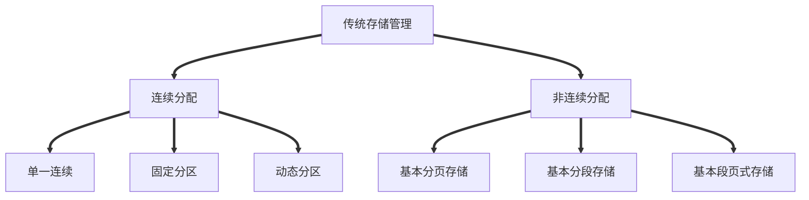
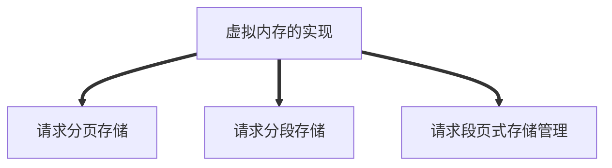
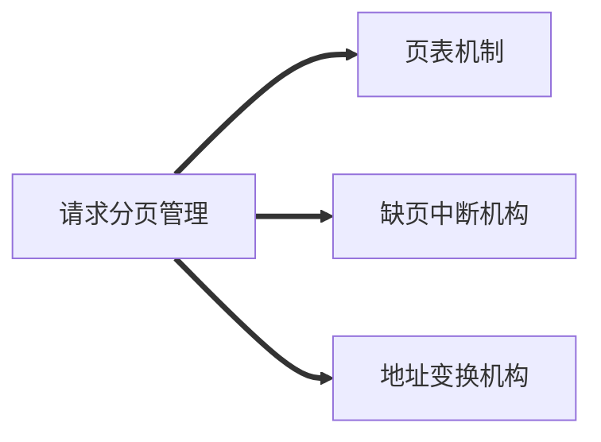

# 第三章内存管理
**内存**=**系统区**+**内存区**

## 基本分页存储管理

**逻辑地址=页号+页内偏移量**

基本分页存储管理的思想：**把进程分页，各个页面可离散地放到各个内存块中**
基本概念
页框=内存块=页帧=物理块=物理页：内存中的块
页/页面：逻辑上的块，但是其大小与页框相等。

### 基本地址变换机构
页表寄存器（PTR）：存放页表在内存中的起始地址F和页表长度M,**进程未执行时会放在进程控制块（PCB）中**，进程被调度时，操作系统内核会把它们放到页表寄存器中
> 地址变换过程：
> 1. 根据逻辑地址算出页号，页内偏移量
> 2. 检查页号是否越界
> 3. 若页号合法则根据页表起始地址和页号找到对应页表项（==第一次访问内存—查页表==）
> 4. 根据页表项的内存块号、页内偏移量得到最终物理地址
> 5. 访问物理地址对应的物理单元（==第二次访问内存—访问目标单元==）

注：**页式管理**是**一维**的

 快表：又称联想寄存器（TLB），是一种访问速度比内存快很多的**高速缓存**，用来存放**最近频繁访问的页表项的副本**。
 
寄存器=>高速缓存(Cache)=>内存（RAM）=>外存

引入快表后**地址变换**的**不同**：
快表**命中**，则只需要**一次访存**
快表**未命中**，则仍需要**两次访存**（==第一次==访存查找==页表项==时，会同时==复制到快表==）

#### 局部性原理
**时间局部性**：若执行了程序中的某条指令，那么==不久后==这条指令==很可能==再次被==执行==。
**空间局部性**：一旦程序访问了某个存储单元，则==不久后附近的存储单元==也==很可能被访问==

TLB（快表）与Cache的区别：

|存储器件|TLB|Cache|
|----|----|----|
|区别|只有页表项的副本|可能还有其他各种数据的副本|

### 两级页表
#### 单级页表的问题
1. 页表必须连续存放，因此当页表很大时，需要占用很多连续的页框
2. 没必要让整个页表常驻内存，因为进程在一段时间内可能只需要访问某几个特定的页面

一号页表（页目录表）->二号页表->页内偏移量

注意细节：
1. 多级页表机制下，**各级页表的大小不能超过一个页面**
2. 两级页表的访存次数为3次：
> - 第一次访存：页目录表
> - 第二次访存：二级页表
> - 第三次访存：访问目标内存单元
N级页表访问逻辑地址需要N+1次访存（无快表情况）

## 基本分段存储管理

**逻辑地址=段号+页内偏移量**

分段：按照程序**自身逻辑**关系**划分为若干个段**，每个段都有段名，**每段从0开始编址**，每个段在内存中占据连续空间，各段之间可以不相邻

1. 段号的位数决定了每个进程最多可以分几个段
2. 段内地址位数决定了每个段的最大长度是多少

### 段表
1. 由**段号**、**段长**、**基址**三部分组成
2. **各个段表项长度相同**，且段号可以是隐含的，不占存储空间。

## 分段与分页的区别
1. - **页**是信息的**物理单位**。分页的目的是为了实现离散存储，提高内存利用率。分**页**仅仅是系统管理需要，完全是**系统行为**，**对用户不可见**。
	- **段**是信息的**逻辑单位**，分段主要目的是更好地满足用户需求。一个段通常包含着一组属于逻辑模块的信息。**分段对用户是可见的**，用户编程时需要显式的给出段名。
2. **页的大小固定且由系统决定；段的长度不固定，取决于用户编写的程序**。
3. **分页**的用户进程**地址空间是一维**的，**分段**的用户进程**地址空间是二维**的
4. **分段**比分页**更容易实现信息的共享和保护**。（纯代码/可重入代码：不能被修改的代码）
5. 分页（单级页表）两次访存（页表->目标内存单元），分段两次方寸（段表->目标内存单元）

||优点|缺点|
|----|----|----|
|分页|内部空间利用率高，==不会产生外部碎片==，只有少量的页内碎片|不方便按逻辑模块实现信息的共享和保护|
|分段|方便安装逻辑模块实现信息的共享和保护|若段长过大，分配空间会很不方便。同时段式管理会==产生外部碎片==|

### 段页式管理

定义：先将进程按==逻辑分段==，然后再将==各个段分页==
**逻辑地址=段号+页号+页内偏移量**
**地址结构：二维**
段号：位数决定每个进程最多可以分几个段
页号：位数决定每个段最多能有多少页
页内偏移量：决定页面大小、内存块大小

段表结构：段号、==页表长度==、页表存放地址
页表结构：页号、页面存放地址

访存次数：3
第一次：查段表
第二次：查页表
第三次：查目标地址
若使用快表则只需要第三次

## 虚拟内存

**一次性**：**作业必须一次性全部装入内存才能运行**
> 引起问题
> 1. 大作业很大时，无法全部装入，导致**大作业无法运行**
> 2. 大量作业要求运行时，由于内存无法容纳所有作业，因此只有少数作业能运行，==导致多道程序并发度下降==
**驻留性**：**作业 被装入后==一直驻留在内存中==**

提出背景：局部性原理

定义：
1. 将即将用到的部分装入内存，暂时未用到的部分留在外存
2. 信息不在内存时，操作系统从外存中调入内存
3. 内存空间不够时，暂时用不到的信息换出外存

特征：
- 多次性：多次调入内存
- 对换性：允许在作业运行时，将作业换入、换出
- 虚拟性：从逻辑上扩充了内存容量

虚拟内存技术基于离散存储技术。

主要区别：
1. 请求调页（段）功能：访问信息不在内存时，操作系统从外存调入内存
2. 页（段）面置换功能：内存不够时，不用的信息换出外存

### 请求分页存储技术

与基本分页存储主要区别：
1. 请求调页功能：访问信息不在内存时，操作系统从外存调入内存
2. 页面置换功能：内存不够时，不用的信息换出外存

#### 页表机制

页表结构：黄色部分为请求分页特有
- 内存块号
- ==状态位==：判断是否调入内存，0-未调入，1-已调入
- ==访问字段==：记录最近被访问过几次或时间
- ==修改位==：页面被调入后是否被修改
- ==外存地址==：页面在外存中存放位置

缺页中断为内中断

<!--stackedit_data:
eyJkaXNjdXNzaW9ucyI6eyJaekdzMTFKdWQ3bmFyTGZBIjp7In
N0YXJ0IjoxOTgwLCJlbmQiOjE5ODQsInRleHQiOiLpobXooajp
lb/luqYifX0sImNvbW1lbnRzIjp7Im5lbjlhV3VYeHU0QlBYb0
giOnsiZGlzY3Vzc2lvbklkIjoiWnpHczExSnVkN25hckxmQSIs
InN1YiI6ImdoOjUzNTU4MTAwIiwidGV4dCI6IuWIhuauteeuoe
eQhuS4reS4uuauteihqOmVv+W6piIsImNyZWF0ZWQiOjE2Mzc4
MTMxNDI5NTB9fSwiaGlzdG9yeSI6WzExOTYzODg1OTEsMTk3MD
U2NDY2NCwtNzA2Nzk2MjIxLDE4NTczNzQ3NjYsMjMwNzA5NzU3
LDY2ODI0MzA1NiwtMTY2NTMwMjAzMiwxMDQwODU1MDkzLC0xNT
c3MjI5NDE3LDEwMDEwNzcyMTgsODc2MTQ3OTcwLDY2MzA5MDg2
OCwxNTU3MzU1Mzk0LC0xMjcyNjIzNTQwLDE1NDI3NjMzMjYsMj
A0NzA4ODkwMl19
-->