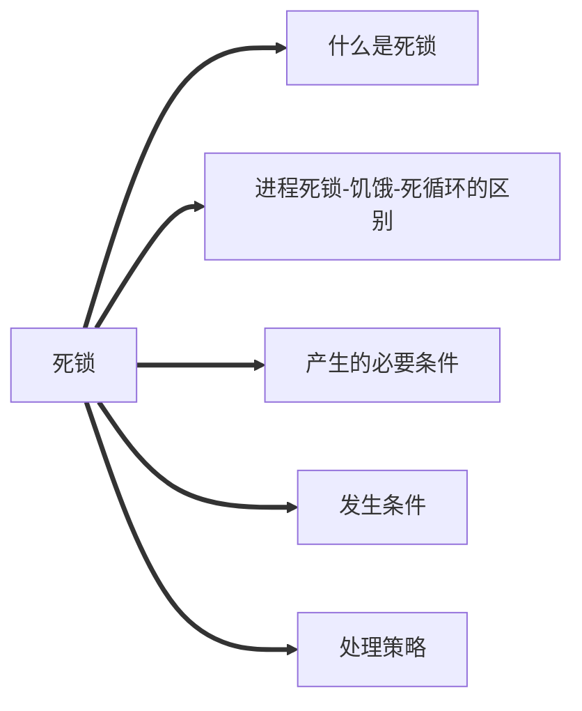

## 管程
### 引入原因
> 信号量机制存在:编写程序困难、易出错，从而无法很好的解决同步问题，==为了让程序员高效率编码，不再花费精力在复杂的PV操作==。

### 定义
> 一种特殊的软件模块，由四部分组成。
> > 1. 局部于管程的===共享数据结构==说明
> > 2. 对数据结构进行操作的==一组过程==
> > 3. 局部于管程的共享数据设置初始值的语句。
> > 4. 管程有一个名字

### 基本特征
>1. 局部于管程的数据只能被局部于管程的过程访问
>2. 一个进程只有通过调用管程内的过程才能进入管程访问共享数据。
>3. ==每次仅允许一个进程在管程内执行某个内部过程。==
>

注:==各进程必须互斥访问管程的特性是由编译器实现的==

## 死锁

### 定义
> 各个进程互相等待对方手里的资源，导致各进程都阻塞，无法向前推进的现象。

### 饥饿
> 由于长时间得不到想要的资源，某进程无法向前推进的现象。

### 死循环 
> 某进程执行过程中一直跳不出某个循环的现象。

### 三者异同
> ==共同点==:都是进程无法顺利向前推进度现象(故意设计的死循环除外)
> ==不同点==:
> 1. 死锁:==至少有两个或者两个以上的进程同时发生死锁==，且发生死锁的进程==一定==处于==阻塞态==。
> 2. 饥饿:==可能只有一个进程发生饥饿==，进程可能处于==阻塞态==(如长期得不到==I/O设备==)，也可能是==就绪态==(长期得不到==处理机==)。
> 3.  死循环:可能只有一个进程发生死循环。进程可以是==运行态==，只是无法像期待那样顺利推进。

注:
1. 死锁和饥饿是由于操作系统分配资源的策略不合理导致，而死循环是由代码逻辑错误导致。
2. ==死锁和饥饿是管理者(操作系统)的问题==，==死循环是被管理者的问题==。

### 发生的必要条件
1. ==互斥条件==：一个资源每次只能被一个进程使用
2. ==不剥夺条件==：进程已获得的资源，在末使用完之前，不能强行剥夺
3. ==请求和保持条件==：一个进程因请求资源而阻塞时，对已获得的资源保持不放
4. ==循环等待条件==：若干进程之间形成一种头尾相接的循环等待资源关系。

注: 发生死锁一定发生循环等待，循环等待不一定会有死锁

### 发生时机
1. 对系统资源的竞争
2. 进程推进顺序非法
3. 信号量的使用不当

### 处理策略
1. 预防死锁---静态策略
2. 避免死锁---动态策略
3. 死锁的检测和解除

#### 安全序列
> 每个进程都能顺利完成的资源分配序列。
> 注: ==只要能找出一个安全序列==，系统就是==安全状态==，当然安全序列也可以有==多个==；若分配资源后无法找到安全序列，系统就进入了==不安全状态==。

==安全状态下====一定====不会发生死锁==，==不安全状态====可能==发生==死锁==

#### 银行家算法
##### 核心思想
> 在进程提出资源申请时，先预判此次分配是否会导致系统进入不安全状态，若是，则拒绝请求，让进程先阻塞等待。

##### 步骤
1. 检查此次申请是否超过了之前声明的最大需求数。
2. 检查此时系统剩余可用资源是否还能满足这次请求。
3. 试探分配，更改数据结构
4. 用安全性算法检查此次分配是否会导致系统进入不安全状态。

##### 安全性算法步骤
> 检查当前剩余可用资源是否能满足某个进程都最大需求，若可以就把该进程加入安全序列，并把该进程持有的资源全部回收。
> 不断重复上述过程，看最终能否让所有进程都加入安全序列
<!--stackedit_data:
eyJoaXN0b3J5IjpbLTEzMTIwNjY0MzUsNTc1MDAyNTU4LC0xMD
c5NTQ4NjgzLC0yMzI1MTQzOThdfQ==
-->