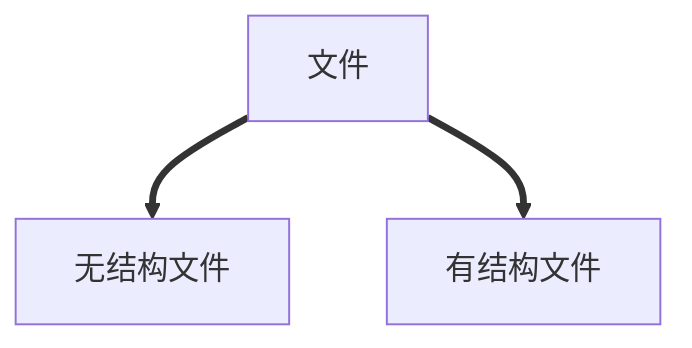
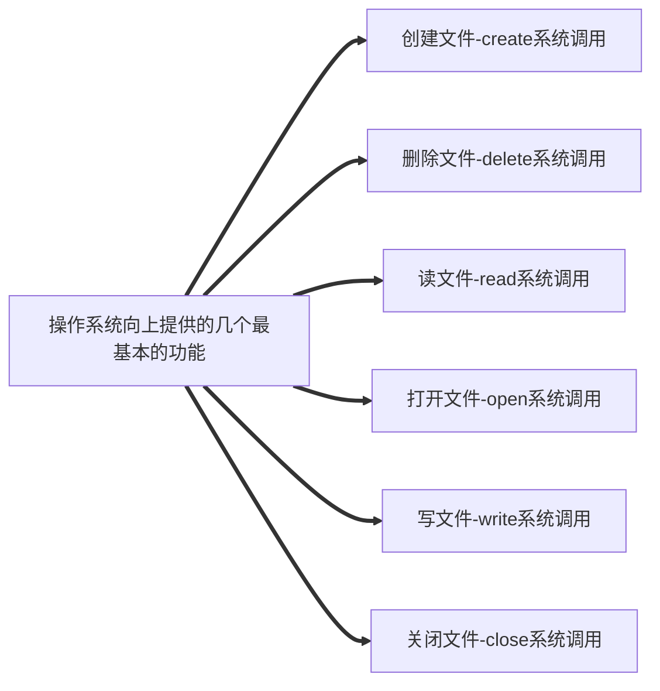

# 文件管理
## 文件的属性
> 1. 文件名
> 2. 标识符
> 3. 类型
> 4. 位置
> 5. 大小
> 6. 创建时间、桑次修改时间
> 7. 文件所有者信息
> 8. 保护信息


无结构文件（流文件）：由一系列二进制或字符流组成
有结构文件：由记录组成




注：**操作系统以“块”为单位为文件分配存储空间**。

## 文件的逻辑结构

### 思维导图

>  ```mermaid
>  graph LR
>  A[文件的逻辑结构]
>  B[无结构逻辑]
>  C[有结构文件]
>  C1[顺序文件]
>  C2[索引文件]
>  C3[索引顺序文件]
>  A==>B
>  A==>C
>  C==>C1
>  C==>C2
>  C==>C3
>  ```
> **无结构文件**：文件内部的数据就是一系列二进制流或字符流组成，又称为“流式文件”。
>  **有结构文件**：由一组相似的记录组成，又称“记录式文件”。
>  顺序文件：文件中的记录按顺序排列（逻辑上），记录可以是定长或者可变长的。各个记录在物理上可以
<!--stackedit_data:
eyJoaXN0b3J5IjpbMTU1NDkyNDYyOSwtMjAxMDgzODk5NSwtMT
ExNzYwOTU4NywtMTc2MzYwOTYxNCwtMjA4ODc0NjYxMl19
-->