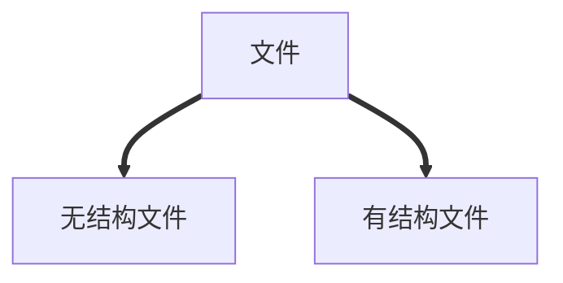
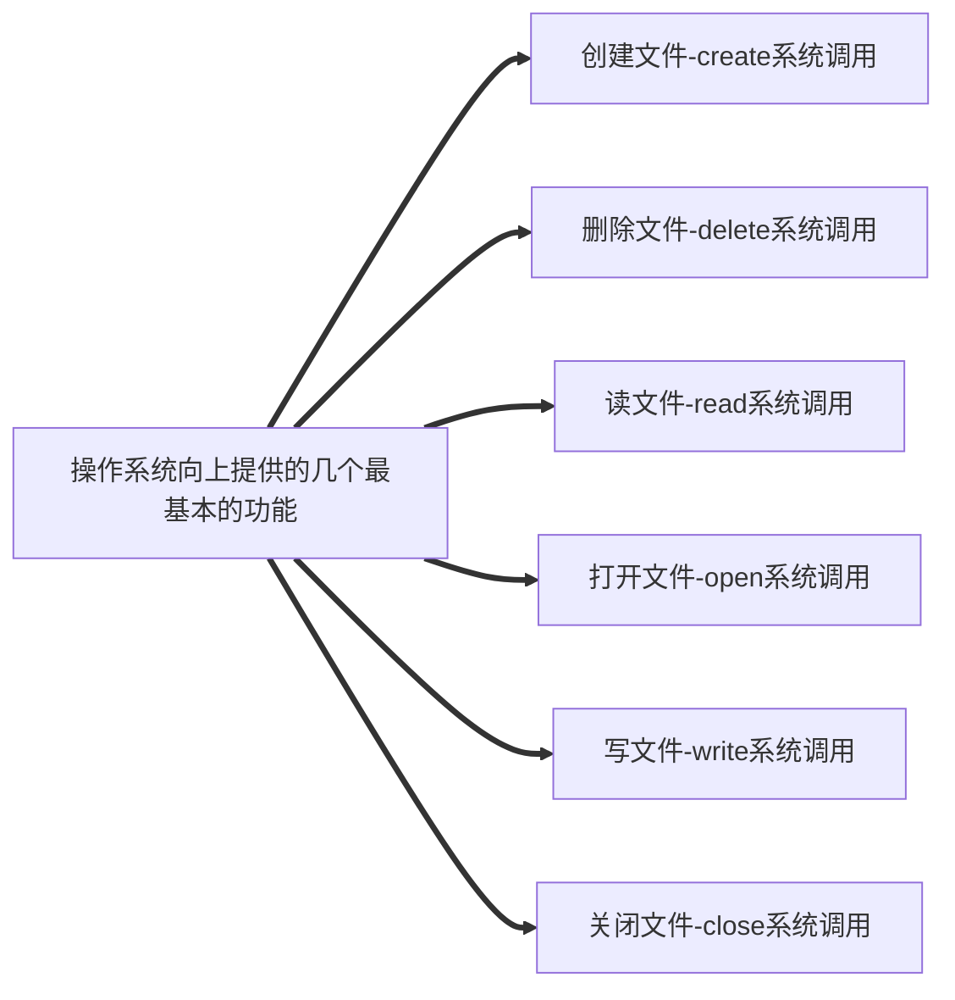

# 文件管理
## 文件的属性
> 1. 文件名
> 2. 标识符
> 3. 类型
> 4. 位置
> 5. 大小
> 6. 创建时间、桑次修改时间
> 7. 文件所有者信息
> 8. 保护信息


无结构文件（流文件）：由一系列二进制或字符流组成
有结构文件：由记录组成




注：**操作系统以“块”为单位为文件分配存储空间**。

## 文件的逻辑结构

### 思维导图

>  ```mermaid
>  graph LR
>  A[文件的逻辑结构]
>  B[无结构逻辑]
>  C[有结构文件]
>  C1[顺序文件]
>  C2[索引文件]
>  C3[索引顺序文件]
>  A==>B
>  A==>C
>  C==>C1
>  C==>C2
>  C==>C3
>  ```
> **无结构文件**：文件内部的数据就是一系列二进制流或字符流组成，又称为“流式文件”。
>  **有结构文件**：由一组相似的记录组成，又称“记录式文件”。
>  **顺序文件**：文件中的记录按顺序排列（逻辑上），==记录==可以是==定长==或者==可变长==的。各个记录在==物理上==可以==顺序存储==或者==链式存储==
>  > - 串结构：记录之间的顺序与关键字无关
>  > - 顺序结构：记录之间的顺序按关键字顺序排列


**注**：在==顺序文件==中，只有==顺序存储的定长记录==可以实现==随机存储==，且**只有顺序结构才能快速找到某关键字**；式存储与顺序可变长记录都不可以。题目中一般==默认为顺序存储==。

### 索引文件
> 定义：建立一张索引表加快文件检索速度。没调记录对应一个索引项。（**索引表本身是定长记录的顺序表**）
> **用途**：主要用于对信息处理的及时性要求比较高的场合
> 
> **注**：可以用不同的数据项建立多个索引项
 
**索引顺序文件**：建立索引表的同时，不是为每个记录建立一个索引项，而是**一组记录对应一个索引项**。

**多级索引顺序文件**：建立==多级索引表==，不是为每个记录建立一个索引项，而是为**一组低级索引项对应一个高级索引项**，**一组记录对应一个最低级索引项**。

## 文件目录

```mermaid 
graph LR
A[文件目录]
B[文件控制块]
C[目录结构]
D[索引结点]
C1[单级目录结构]
C2[两级目录结构]
C3[多级目录结构]
C4[无环图目录结构]
A==>B
A==>C
A==>D
C===>C1
C===>C2
C===>C3
C===>C4

**文件控制块**:
<!--stackedit_data:
eyJoaXN0b3J5IjpbLTEyMjkzNDY0NDQsLTY0ODE1Nzg2NywtMj
AxMDgzODk5NSwtMTExNzYwOTU4NywtMTc2MzYwOTYxNCwtMjA4
ODc0NjYxMl19
-->