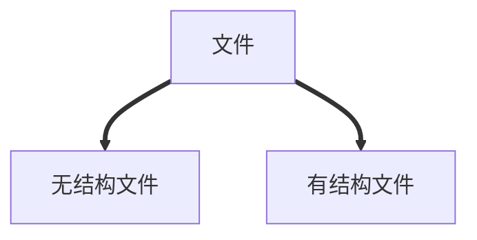

# 文件管理
## 文件的属性
> 1. 文件名
> 2. 标识符
> 3. 类型
> 4. 位置
> 5. 大小
> 6. 创建时间、桑次修改时间
> 7. 文件所有者信息
> 8. 保护信息

无结构文件（流文件）：由一系列二进制或字符流组成
有结构文件：由记录组成

<!--stackedit_data:
eyJoaXN0b3J5IjpbLTE3NjM2MDk2MTQsLTIwODg3NDY2MTJdfQ
==
-->