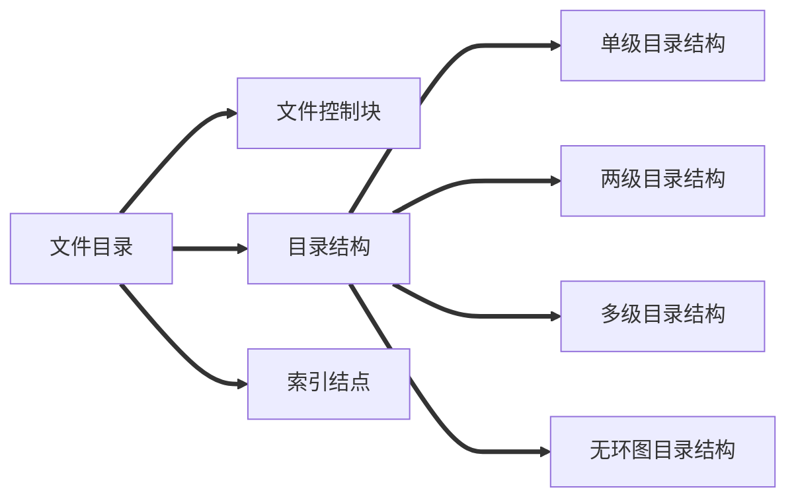
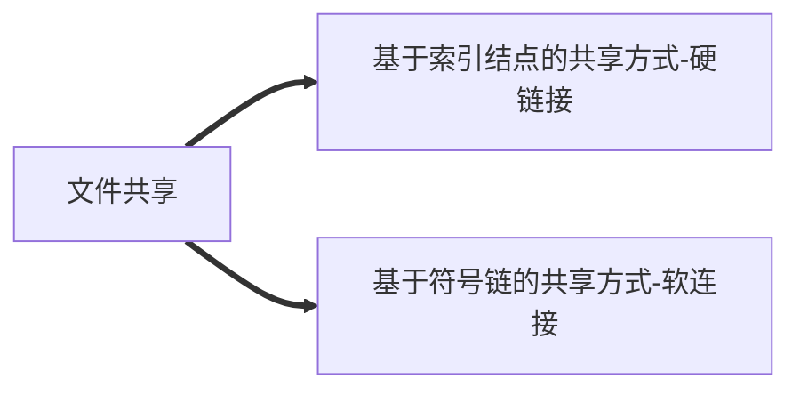
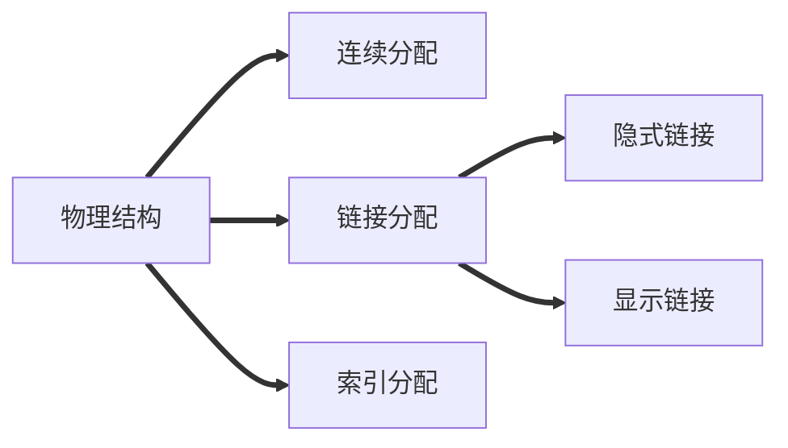

# 文件管理
## 文件的属性
> 1. 文件名
> 2. 标识符
> 3. 类型
> 4. 位置
> 5. 大小
> 6. 创建时间、桑次修改时间
> 7. 文件所有者信息
> 8. 保护信息


无结构文件（流文件）：由一系列二进制或字符流组成
有结构文件：由记录组成


注：**操作系统以“块”为单位为文件分配存储空间**。

## 文件的逻辑结构

### 思维导图

>  ```mermaid
>  graph LR
>  A[文件的逻辑结构]
>  B[无结构逻辑]
>  C[有结构文件]
>  C1[顺序文件]
>  C2[索引文件]
>  C3[索引顺序文件]
>  A==>B
>  A==>C
>  C==>C1
>  C==>C2
>  C==>C3
>  ```
> **无结构文件**：文件内部的数据就是一系列二进制流或字符流组成，又称为“流式文件”。
>  **有结构文件**：由一组相似的记录组成，又称“记录式文件”。
>  **顺序文件**：文件中的记录按顺序排列（逻辑上），==记录==可以是==定长==或者==可变长==的。各个记录在==物理上==可以==顺序存储==或者==链式存储==
>  > - 串结构：记录之间的顺序与关键字无关
>  > - 顺序结构：记录之间的顺序按关键字顺序排列


**注**：在==顺序文件==中，只有==顺序存储的定长记录==可以实现==随机存储==，且**只有顺序结构才能快速找到某关键字**；式存储与顺序可变长记录都不可以。题目中一般==默认为顺序存储==。

### 索引文件
> 定义：建立一张索引表加快文件检索速度。没调记录对应一个索引项。（**索引表本身是定长记录的顺序表**）
> **用途**：主要用于对信息处理的及时性要求比较高的场合
> 
> **注**：可以用不同的数据项建立多个索引项
 
**索引顺序文件**：建立索引表的同时，不是为每个记录建立一个索引项，而是**一组记录对应一个索引项**。

**多级索引顺序文件**：建立==多级索引表==，不是为每个记录建立一个索引项，而是为**一组低级索引项对应一个高级索引项**，**一组记录对应一个最低级索引项**。

## 文件目录


**文件控制块（FCB）**:目录本身就是一种==有结构文件==，由一条条记录构成。**目录文件中的一条记录**就是一个**文件控制块**。FCB就是一个**文件目录项目**。
- FCB包含文件的基本信息（文件名、物理地址、逻辑结构、物理结构等）、存储控制信息（是否可读/可写、禁止访问的用户名单等）、使用信息（文件的建立时间、修改时间等）。
- **最重要、最基本的是：文件名、文件存放的物理地址。**

### 目录操作
1. 搜索
2. 创建文件
3. 删除文件
4. 显示目录
5. 修改目录

### 目录结构

- **单级目录结构**：==整个系统==中只建立==一张目录表==，==每个文件==占==一个目录项==。（**不允许文件重名，不适用多用户操作系统**）
- **两级目录结构**：目录分为==主文件目录（MFD）==和==用户文件目录(UFD)==（**不能对文件进行分类**）
- **多级目录结构（树形目录结构）**：==不便于实现文件的共享==
- **无环图目录结构**：在树形目录结构的基础上，增加一些指向同一节点的有向边，使整个目录成为一个==有向无环图==（**可以用不同文件名指向同一个文件，甚至是目录**）

### 索引节点（FCB的改进）
定义：让除了文件名外的信息全部放到索引结点中，**建立索引表，让文件名作为索引键，索引结点指针作为索引项**


## 文件保护

1. **口令保护**
	- **优点**：保存口令的空间开销不多，验证口令的时间开销也很小
	- **缺点**：正确的“口令”存放在系统内部，不够安全
2. **加密保护**：使用某个“密码”对文件进行加密，访问时需要提供密码才能正确解密
	- **优点**：保密性强，不需要在系统中存储“密码”
	- **缺点**：编码/译码，或者说加密/解密需要花费一定时间

3. **访问控制**：在每个文件的FCB中增加一个**访问控制列表（ACL）**，在该表中记录各个（组）用户对文件的访问权限
	- 访问类型：
		1. 读
		2. 写
		3. 执行
		4. 添加
		5. 删除
		6. 列表清单
	- **优点**：实现灵活，可以实现复杂的文件保护功能

## 文件共享

### 基于索引结点的共享方式-硬链接

> 定义：各个用户的目录项指向同一个索引结点（索引结点中需要有连接计数count）

### 基于符号链的共享方式-软连接

> 定义：在一个Link型的文件中记录共享文件的存放路径（Windows快捷方式）

## 文件实现




|          | 定义                                                         | 目录项内容                                                   | 优点                                                         | 缺点                                                         |
| -------- | ------------------------------------------------------------ | ------------------------------------------------------------ | ------------------------------------------------------------ | ------------------------------------------------------------ |
| 顺序分配 | 为文件分配的必须的连续的磁盘块                               | 起始块号、文件长度                                           | 存取速度快、支持随机访问                                     | 会产生碎片、不利于文件拓展                                   |
| 隐式链接 | 除文件的最后一个盘块之外，每个     盘块都存有指向下一个盘块的指针 | 起始块号、结束块号                                           | 可解决碎片问题，     外存利用率高，文件     拓展容易实现     | 只能顺序访问，不能     随机访问 |
| 显式链接 | 建立一张文件分配表（FAT），     显式记录盘快的先后关系     （开机后FAT常驻内存） | 起始块号                                                     | 除了拥有隐式链接的优点之     外，还可以通过查询内存中的     FAT实现随机访问 | FAT需要占用一定的存储空间                                    |
| 索引分配 | 为文件数据块建立索引表。     若文件太大，可采用链接方案     、多层索引、混合索引 | 链接方案记录的是第一个索引     块的块号，多层/混合索引记     录的是顶级索引块的块号 | 支持随机访问、     易于实现文件的拓展                        | 索引表需要占用一定的存储空间。     访问数据块前需要先读入索引块。     若采用链接方案，查找索引块时可     能需要很多次读磁盘操作。 |


<!--stackedit_data:
eyJoaXN0b3J5IjpbMjA5NDEwNTg2NiwxMDg3OTkwOTM0LDEzNj
c1NDM5OTQsMzczMDE0NTQ2LC0xMDAyMDI4NDIyLC0xMTY5NDYw
NDI3LDI4NDM1ODExOCwtNDAzMzI0NDA2LDEwNzM4MTE5MDAsLT
g1MTIzNDEzLC0xOTc3ODc0NCw1NTQ3MzExMjcsLTY0ODE1Nzg2
NywtMjAxMDgzODk5NSwtMTExNzYwOTU4NywtMTc2MzYwOTYxNC
wtMjA4ODc0NjYxMl19
-->