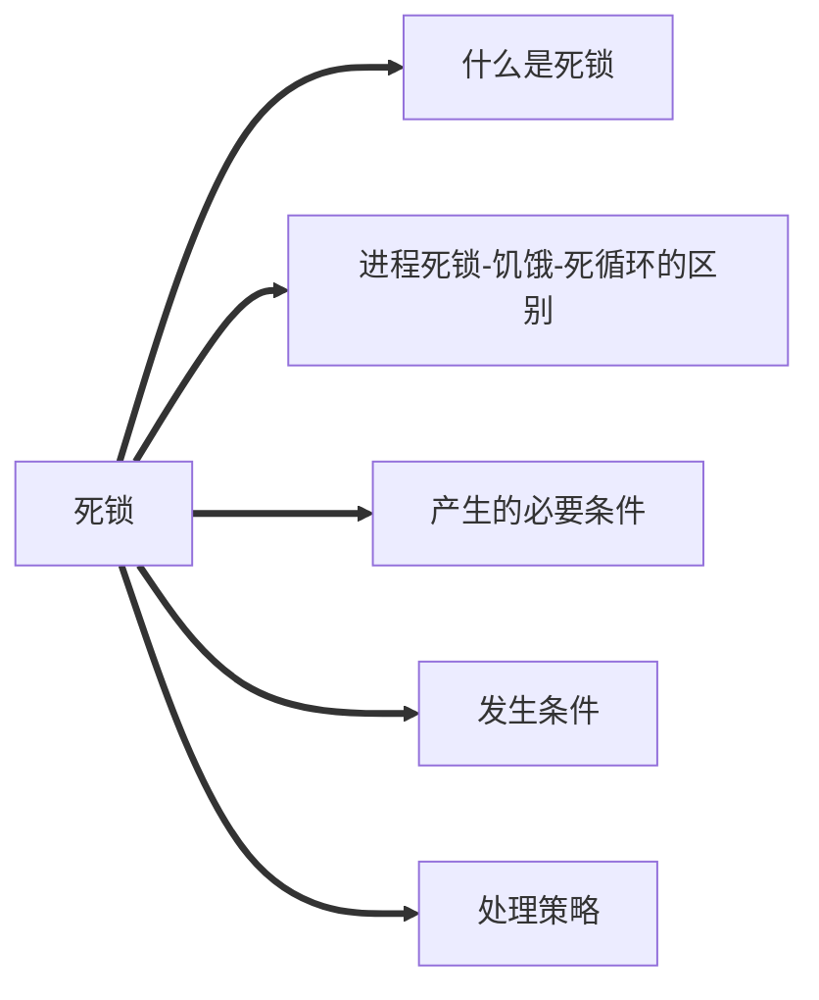

## 管程
### 引入原因
> 信号量机制存在:编写程序困难、易出错，从而无法很好的解决同步问题，==为了让程序员高效率编码，不再花费精力在复杂的PV操作==。

### 定义
> 一种特殊的软件模块，由四部分组成。
> > 1. 局部于管程的===共享数据结构==说明
> > 2. 对数据结构进行操作的==一组过程==
> > 3. 局部于管程的共享数据设置初始值的语句。
> > 4. 管程有一个名字

### 基本特征
>1. 局部于管程的数据只能被局部于管程的过程访问
>2. 一个进程只有通过调用管程内的过程才能进入管程访问共享数据。
>3. ==每次仅允许一个进程在管程内执行某个内部过程。==
>

注:==各进程必须互斥访问管程的特性是由编译器实现的==

## 死锁

### 定义
> 各个进程互相等待对方手里的资源，导致各进程都阻塞，无法向前推进的现象。

### 饥饿
> 由于长时间得不到想要的资源，某进程无法向前推进的现象。

### 死循环 
> 某进程执行过程中一直跳不出某个循环的现象。

### 三者异同
> ==共同点==:都是进程无法顺利向前推进度现象(故意设计的死循环除外)
> ==不同点==:
> 1. 死锁:==至少有两个或者两个以上的进程同时发生死锁==，且发生死锁的进程==一定==处于==阻塞态==。
> 2. 饥饿:==可能只有一个进程发生饥饿==，进程可能处于==阻塞态==(如长期得不到==I/O设备==)，也可能是==就绪态==(长期得不到==处理机==)。
> 3.  死循环:可能只有一个进程发生死循环。进程可以是==运行态==，只是无法像期待那样顺利推进。

注:
1. 死锁和饥饿是由于操作系统分配资源的策略不合理导致，而死循环是由代码

<!--stackedit_data:
eyJoaXN0b3J5IjpbLTE5MTE4MzEyMDAsMTUxMzg5NzI1NV19
-->