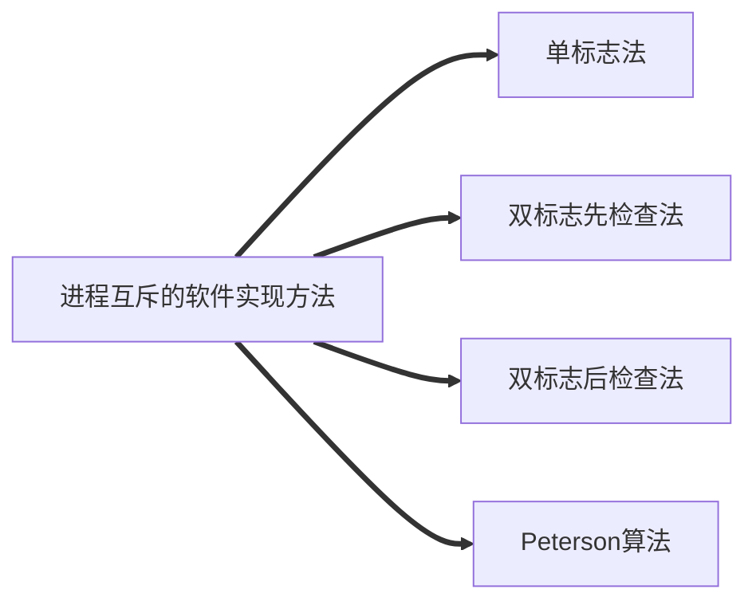

# 进程管理

## 单标志法

> 算法思想：
>
> > 两个进程在==访问完临界区后==会把使用临界区的权限转交给另一个进程。也就是说==每个进程进入临界区的权限只能被另一个进程赋予==。

> 主要问题：
>
> > ==违背“空闲让进”原则==。

## 双标志先检查法

> 算法思想: 
>
> > 设置一个布尔型数组flag[],数组中各个元素用来==标记各进程想进入临界区的意愿==，比如"flag[0] = true" 意味着0号进程P0现在想要进入临界区。每个进程在进入临界区之前先检查当前有没有别的进程想进入临界区，如果没有，则把自身对应的标志flag[i]设为true,之后开始访问临界区。

> 代码实现
>
> 

> 主要问题：
>
> > ==违反“忙则等待”原则==

## 双标志后检查法

>算法思想：
>
>> 双标志先检查法的改版，前一个算法的问题是先"检查"后"上锁",但是这两个操作又无法一气呵成，因此导致了两个进程同时进入临界区的问题。因此，人们又先想到先”上锁“后”检查“的方法，来避免上述问题。
>
>代码实现
>
>

> 主要问题
>
> > 虽然解决了“忙则等待”问题，但是又违背了“空闲让进”和“有限等待”原则，会因各进程都长期无法访问临界资源而产生的“饥饿”现象。

## Peterson算法

> 算法思想：
>
> > 结合双标志法、单标志法的思想，如果双方都争着想进入临界区，那可以让进程尝试“孔融让梨”（谦让）。做一个有礼貌的进程。
>
> 代码实现
>
> > 

> 主要问题
>
> > 解决了进程互斥问题，遵循了空闲让进、忙则等待、有限等待三个原则，但是依然未遵循让权等待的原则。

## 小结

<!--stackedit_data:
eyJoaXN0b3J5IjpbLTMxMzUzMTAwNCwyMDQwMjk3NjIyXX0=
-->