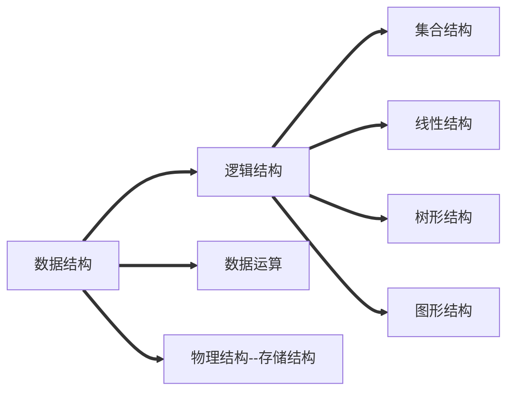
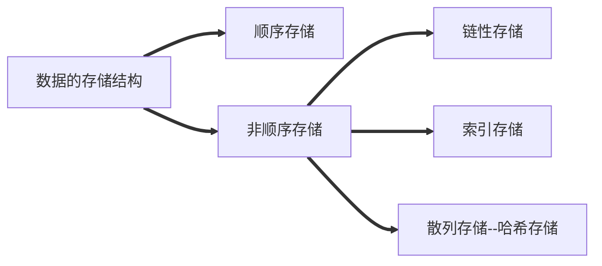

## 思维导图

## 逻辑结构
### 集合
> 各个元素同属于同一个集合，别无其他关系

### 线性结构
> 1. 数据元素之间是==一对一==的关系。
> 2. 除了第一个元素外，所有元素都有==唯一==前驱
> 3. 除了最后一个元素外，所有元素都有==唯一==后继

### 树形结构
> 数据元素之间是==一对多==的关系。

### 图形结构
> 数据元素之间是==多对多==的关系

## 数据结构的运算
> 针对某种逻辑结构，结合实际需求，定义基本运算。

### 定义

> 针对逻辑结构进行，指出运算的功能

### 实现

> 针对存储结构进行，指出运算的具体操作步骤

## 小结

### 数据结构的==定义==由==逻辑结构==及其==数据运算==组成

### 数据结构的==实现==由==物理结构==达成

## 物理结构（存储结构）

### 思维导图

**==注：以下定义基于逻辑结构的线性结构==**

### 顺序存储

> 把==逻辑上相邻==的==元素存储==在==物理位置也相邻==的==存储单元==中，元素之间的关系由存储单元的邻接关系来体现

### 非顺序存储

#### 链性存储

> ==逻辑上相邻==的元素在==物理位置==上可以==不相邻==，借助==指示元素存储地址的指针==来表示元素之间的逻辑关系。

#### 索引存储

> 在==存储==元素信息的==同时==，还==建立附加的索引表==。索引表中的每一项成为索引项，索引项一般形式是（关键字，地址）

#### 散列存储(哈希存储)

> ==根据==元素的==关键字====计算==出元素的存储==地址==

### 总结

1. 若采用==顺序存储==，则各个数据元素在==物理上必须是连续==的；若采用==非顺序存储==，则各个数据元素在物理上可以是==离散==的。
2. 数据的==存储结构==会==影响存储空间分配的方便程度==
3. 数据的==存储结构==会==影响对数据运算的速度==

<!--stackedit_data:
eyJoaXN0b3J5IjpbLTEwNjQyMDE3MDVdfQ==
-->