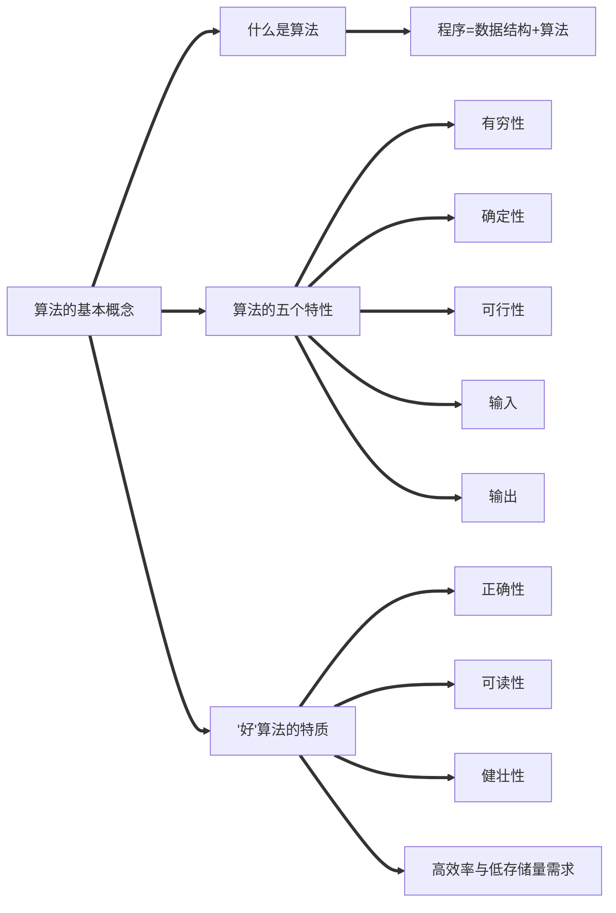
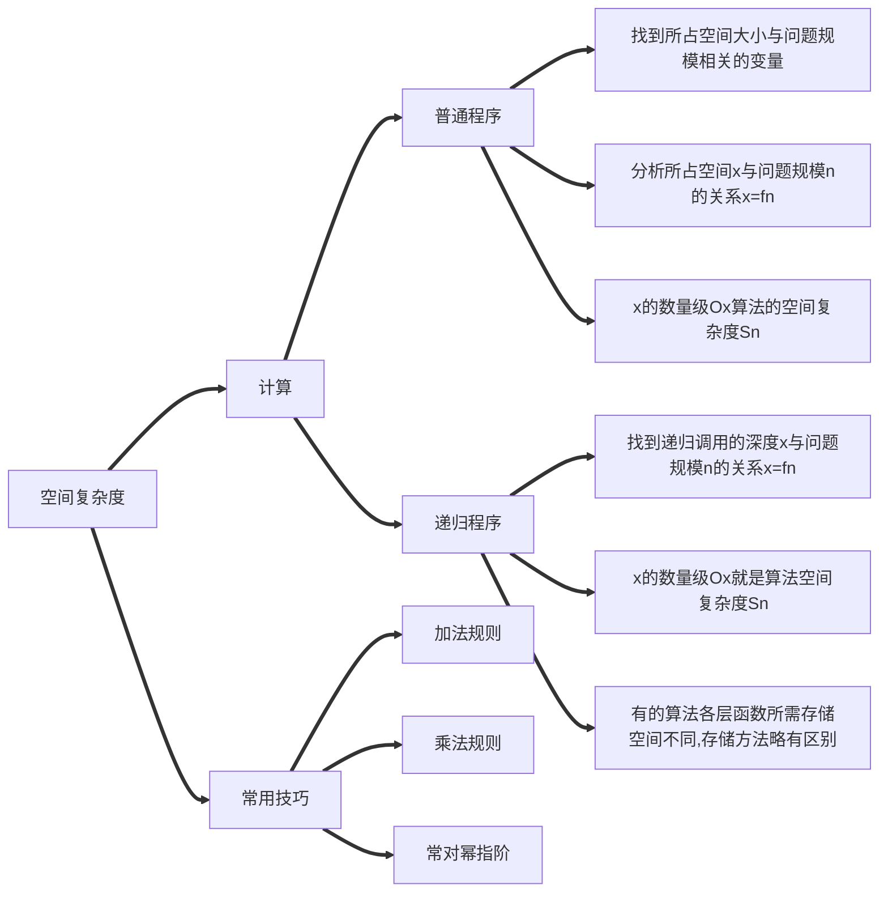

# 什么是算法？

> 程序 = 数据结构 + 算法
>
> 数据结构：如何用数据==正确==的==描述==世界的问题，并存入计算机
>
> 算法：如何==高效的处理==这些==数据==，以解决实际问题

# 算法

## 定义

> ==对特定步骤求解问题的一种描述==，它是指令的有限序列，其中每条指令表示一个或多个操作。

## 特性

> 1. ==有穷性==。一个算法必须总在执行有穷步之后结束，且每一步都可在有穷时间内完成。
>
>    注：==算法==必须是==有穷==的，==程序==可以是==无穷==的
>
> 2. ==确定性==。算法中每条指令必须有确切的含义，对于==相同的输入==只能得出==相同的输出==。
>
> 3. ==可行性==。算法中描述的操作都可以通过已经实现的==基本运算执行有限次==来实现。
>
> 4. ==输入==。一个算法有==零个或多个输入==，这些输入取自于某个特定的对象的集合。
>
> 5. ==输出==。一个算法有==一个或多个输出==，这些输出是与输入有着某种特定关系的量。

## ”好“算法的特质

> 1. 正确性。算法应能够正确地解决求解问题。
> 2. 可读性。算法应该具有良好的可读性，以帮助人们理解。
> 3. 健壮性。输入非法数据时，算法能适当地做出反应或进行处理，而不会产生莫名其妙的输出结果。
> 4. ==高效率==与==低存储量需求==

## 思维导图小结

# 算法效率的度量
## 思维导图

## 时间复杂度
>  

## 空间复杂度
==注==:无论问题规模如何变化，算法允许所需的内存空间都是固定的常量，既算法的空间复杂度为常量。

> 
<!--stackedit_data:
eyJoaXN0b3J5IjpbLTI5NjAyNTE3OCw0NzE1MzE5ODgsLTg3OD
gyNzYwOCwxNzg0NDI3NzQ5LC0xNDY2MzY5MDg3XX0=
-->