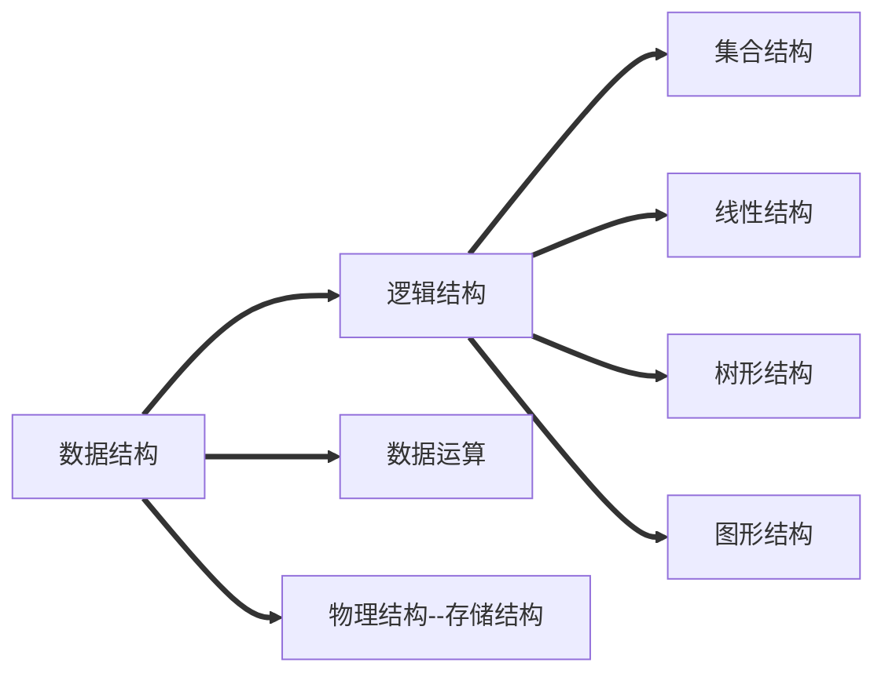

## 思维导图

## 逻辑结构
### 集合
> 各个元素同属于同一个集合，别无其他关系

### 线性结构
> 1. 数据元素之间是==一对一==的关系。
> 2. 除了第一个元素外，所有元素都有==唯一==前驱
> 3. 除了最后一个元素外，所有元素都有==唯一==后继

### 树形结构
> 数据元素之间是==一对多==的关系。

### 图形结构
> 数据元素之间是==多对多==的关系

<!--stackedit_data:
eyJoaXN0b3J5IjpbMzM0ODU3MjQxXX0=
-->