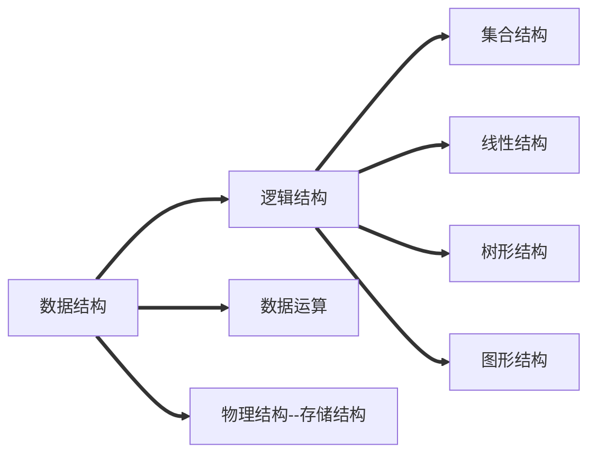

```mermaid
graph LR
A[数据结构]
B[逻辑结构]
C[数据运算]
D[物理结构--存储结构]
B1[集合结构]
B2[线性结构]
B3[树形结构]
B4[图形结构]
A==>B
A==>C
A==>D
B==>B1
B==>B2
B==>B3
B==>B4
```

<!--stackedit_data:
eyJoaXN0b3J5IjpbLTg2MTE2MzY0XX0=
-->