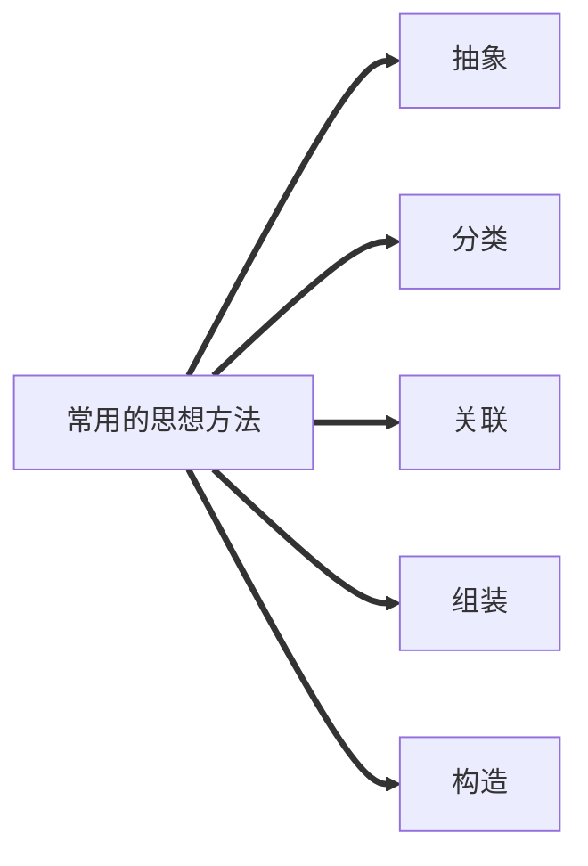

#  预备知识

## 抽象

> ### 书本描述
> 
> > 对一类事物或系统的简化描述。
> 
> ### 个人理解
> 
> > 在特定的研究下，抽取出事物对研究最重要最本质的部分，并忽略其余影响不大甚至无影响的因素，从而得出一个特定的概念或个体。

## 结构

> ### 书本描述
> 
> > 构成事物整体的各个部分及其搭配、组合的方式。
> 
> ### 个人理解
> 
> > 事物中的各个部分以及交叉组合部分

## 抽象与结构的关系

> 结构往往是对事物抽象后得到的结果

## 封装

> ### 书本描述
> 
> > 隐藏了与使用操作无直接关系的内部结构的做法
> 
> ### 个人理解
> 
> > 把与使用者无直接联系部分隐藏起来，从而让使用者无须关心内部结构，只需专心于如何使用的一种方法。
> 
> ### 特点
> 
> 1.  简单；尽可能的易学和易用
>     
> 2.  完整；封装成一个整体，便于管理和移动
>     
> 3.  一致；同类设备的内部结构或者结构功能实现细节可以不同，但可以具有相同或相似的外观和操作接口
>     
> 4.  保密；不公开内部结构和实现细节
>     
> 5.  安全；避免对设备内部的不合适操作和破坏
>     
> 6.  易维护；对设备内部进行专业维修后，设备功能不变，外部结构不变，使用操作也不变。
>     

# 基本概念

## 数据

> 数据是信息的载体，是描述客观属性的数、字符及所有能输入到计算机中并被计算机程序识别与处理的符号的集合。数据是计算机程序加工的原料。

## 数据元素

> 描述一个个体；
> 
> 数据元素是数据的基本单位，通通常作为一个整体进行考虑和处理。
> 
> 一个数据元素可由若干个数据项组成，数据项是构成数据元素的不可分割的最小单位。


## 数据对象

> 具有相同性质的数据元素的集合，是数据的一个子集.

## 数据结构

> 相互之间存在一种或多种特定关系的数据元素的集合。
> 
> ### 注：
> 
> 1.  相同是数据元素可以构成不同的数据结构
>     
> 2.  不同的数据元素可以构成相同的数据结构
>     
> 
> ### 主要学习内容
> 
> > 数据元素之间的关系，以及对数据元素的操作。

``` mermaid
graph LR
A[数据结构]
B[三要素]
C[基本概念]
C1[数据]
C2[数据元素、数据项]
C3[数据对象、数据结构]
C4[数据类型、抽象数据类型ADT]
B1[逻辑结构]
B2[数据运算]
B3[物理结构--存储结构]
A==>B
A==>C
B==>
```
<!--stackedit_data:
eyJoaXN0b3J5IjpbLTEwMDI1Mjc4ODEsLTE5NDc0NjYzOTNdfQ
==
-->